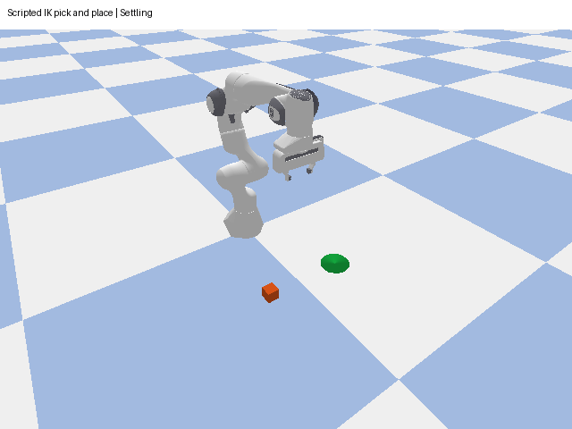

# Robotic Manipulation Simulation: PPO Reaching and Pick-and-Place

A Python/PyBullet portfolio project with two distinct tasks: a KUKA arm learns target reaching with PPO, and a Panda arm performs physical-gripper pick and place using scripted inverse kinematics. Includes reproducible experiments, classical baselines, failure analysis, simulation recordings and automated checks.

## Measured results

| Task / controller | Result | Evaluation scope |
|---|---|---|
| Original PPO reaching | 59.2% | 500 final targets |
| Selected PPO reaching | **81.8%** | The same 500 final targets |
| IK reaching | 100% | The same 500 final targets |
| Corrected scripted pick and place | **108/108** | Varied positions, mass and friction; 54 development + 54 held-out trials |

The reaching test uses seeds 2000-2499 and a 5 cm success threshold. Six equal-budget continuations compare two reward modes across three paired seeds. Legacy rewards performed better on average, so legacy is the training default. Full results, model hashes, CSVs, plots, experiment design and limitations: [experiment report](docs/experiments/README.md). Earlier measurements are retained in [historical benchmarks](docs/benchmarks/README.md).

PPO remains imperfect. Pick-and-place results describe the tested cube scenarios, not universal grasping reliability. Everything runs in simulation; only reaching uses reinforcement learning.

## Setup

Use Python 3.11. In PowerShell, from the project directory:

```powershell
py -3.11 -m venv .venv
.\.venv\Scripts\Activate.ps1
python -m pip install torch==2.3.1 --index-url https://download.pytorch.org/whl/cpu
python -m pip install -r requirements.txt
python check_install.py
```

If PowerShell blocks activation, run `Set-ExecutionPolicy -Scope Process -ExecutionPolicy Bypass`, then activate again. On Linux use `python3.11 -m venv .venv` and `source .venv/bin/activate`. The CPU wheel avoids unnecessary GPU dependencies. The general requirements also support an already-installed compatible PyTorch build.

## Run the demos

Learned reaching:

```powershell
python evaluate.py --render --episodes 20
```

Classical reaching:

```powershell
python evaluate.py --controller ik --render --episodes 20
```

Pick and place:

```powershell
python pick_place.py
python pick_place.py --source 0.42 -0.12 --destination 0.48 0.18 --mass 0.04 --friction 0.5
```

The orange cube has mass, collision geometry and friction. The fingers grasp it through physics contact; it is never attached artificially or teleported. The green marker shows the destination. Closing the GUI stops playback cleanly. Ctrl+C also stops execution.



## Evaluate and save reports

```powershell
python evaluate.py --episodes 500 --seed 2000 --output reports/ppo_final
python evaluate.py --controller ik --episodes 500 --seed 2000 --output reports/ik_final
python evaluate.py --controller random --episodes 200 --seed 0 --output reports/random
python experiments/benchmark_pick_place.py --scenes 6 --seed 2027 --output reports/pick_place
```

Reaching reports include per-episode CSV, JSON summary, a distance plot, a Wilson 95% success interval and checkpoint hash. Episode seeds are `seed + episode`, giving identical targets across controllers. GUI interruption does not save an incomplete benchmark as a complete result. `test_trained_policy.py` remains an alias for the evaluation CLI. The default checkpoint is `models/portfolio/legacy_best_model.zip`; `--model PATH` selects another.

Pick-and-place success requires both-finger contact, a lift above 15 cm, release and a settled cube within 5 cm of the destination. The benchmark crosses three masses and three friction settings with each seeded geometric scene. Moving-link ground contact is logged separately. These checks do not certify self-collision safety.

## Train and reproduce experiments

```powershell
python -m training.train --timesteps 500000
python -m training.train --resume models/portfolio/legacy_best_model.zip --timesteps 100000
python experiments/run_ablation.py --checkpoint models/reference/initial_checkpoint.zip --timesteps 100000 --seeds 7 19 42 --episodes 200 --output reports/reward_ablation
```

Runs use separate directories, fixed validation targets starting at seed 10000, and checkpoint selection by success rate, then mean distance. The starting and final policies are evaluated. Ctrl+C saves an interrupted checkpoint when possible. Training steps can exceed the requested budget due to rollout batching. `--run-dir PATH` must be empty. Logs include configuration, validation JSONL and training CSV.

Legacy reward is negative distance plus a success bonus. `--reward-mode shaped` adds progress, action and ground-contact terms. It is retained for controlled comparisons, not assumed to be an improvement. Resuming under another reward changes the learning objective. The paired-seed experiment starts all runs from the same pretrained model; it does not establish robustness across fresh random initializations.

The original target distribution remains x=[0.3,0.6], y=[-0.4,0.4], z=[0.3,0.7] metres. The raw observation layout is 7 joint angles, 7 velocities, end-effector position and target position. Actions are seven bounded joint-angle increments. Motor targets respect URDF limits; physical dynamics can briefly overshoot. No obstacle or orientation objective is included.

## Analyze and record

```powershell
python experiments/analyze_failures.py reports/ppo_final/episodes.csv --output reports/failures
python record_demo.py --controller ppo --episodes 3 --output reports/ppo.gif
python pick_place.py --headless --gif reports/pick_place.gif --output reports/pick_place.json
```

Failure diagnostics record closest approach, action saturation, time near joint limits and stationary distance. They identify associations, not proven causes. Replay a failed seed with `--episodes 1 --seed NUMBER --render`. Recordings contain actual simulated frames and label the controller.

## Tests and CI

```powershell
python -m pip install -r requirements-dev.txt
python -m pip check
python -m unittest discover -s tests -v
python scripts/check_training.py
```

Tests cover the Gymnasium contract, deterministic targets, isolated physics clients, action validation, episode lifecycle, timeouts, success detection, joint commands, offscreen rendering, report generation, GUI disconnect races, physical grasp/lift/release, slippery cubes and CI configuration. The integration script verifies fresh training, final validation, saved artifacts and resume without requiring bundled models.

The GitHub Actions workflow tests Python 3.11 on Windows and Ubuntu, installs CPU PyTorch, checks dependencies and runs both the suite and training integration. A configured workflow is not a hosted passing result; see the latest Actions run after publication.

## Why compare PPO with IK?

IK uses the known robot geometry and solves this simple reaching task reliably. PPO learns joint coordination from observations and rewards, which makes it useful here for studying learning, reward design and generalization. These results do not justify replacing IK with PPO for this task. The project demonstrates both approaches and measures their differences rather than claiming learning is automatically better.

## Repository layout

- `environment/`: KUKA reaching environment and connection lifecycle.
- `training/`: PPO training and validation.
- `evaluate.py`: evaluation, baselines and GUI playback.
- `pick_place.py`: Panda physical-gripper manipulation and GIF capture.
- `experiments/`: reward ablation, manipulation robustness and failure analysis.
- `tests/` and `scripts/`: automated checks and training integration.
- `examples/`: historical learning demos, run as `python examples/test_observation.py`.
- `models/`: reference and portfolio checkpoints.
- `docs/`: recordings, evidence and experiment reports.

Generated `runs/` and `reports/` are ignored by Git. Selected evidence is copied into `docs/` for publication.

## Portfolio description

"Built a physics-based robotic manipulation simulator using PyBullet, Gymnasium and PPO; improved reaching success from 59.2% to 81.8% on 500 new targets, compared reward designs across three paired continuation seeds, and validated scripted physical-gripper pick and place on 108 varied scenarios."

Be prepared to explain reward design, checkpoint selection, train/validation/test separation, IK versus RL and failure cases. This project does not include learned grasping, object recognition, obstacle avoidance, arbitrary-object robustness, a real robot driver or physical hardware results.

References: [Stable-Baselines3 RL guidance](https://stable-baselines3.readthedocs.io/en/v2.3.2/guide/rl_tips.html), [Gymnasium API](https://gymnasium.farama.org/api/env/), [PyTorch CPU installation](https://pytorch.org/get-started/previous-versions/).
