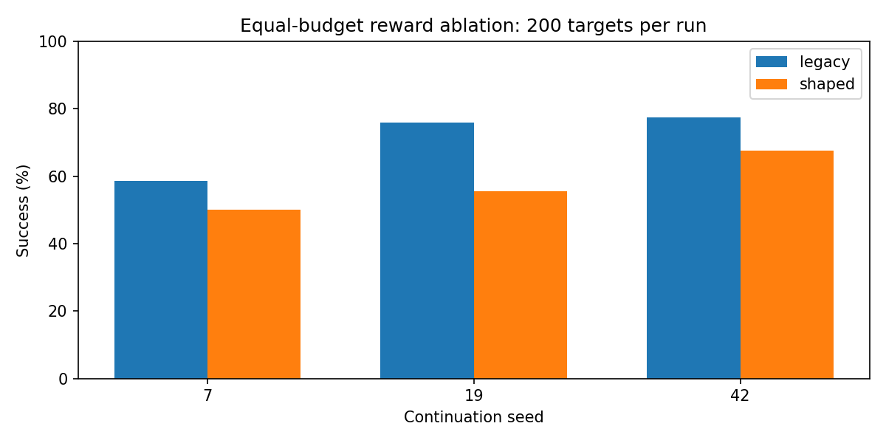

# Portfolio experiments and measured results

## Final untouched target set

After the exploratory ablation, the reward mode was chosen and a legacy checkpoint was selected using validation success and mean distance. Only then was the final target set (seeds 2000-2499) evaluated. The earlier seeds 0-199 and 1000-1199 are exploratory development evidence, not the final independent evaluation of this selection.

| Controller | Success on 500 new targets | Mean final distance (m) | Ground-contact episodes |
|---|---|---|---|
| Original PPO | 296/500 (59.2%) | 0.2630 | 0 |
| Selected PPO | 409/500 (81.8%) | 0.0983 | 0 |
| IK | 500/500 (100.0%) | 0.0463 | 0 |

Success threshold: 5 cm; horizon: 200 control steps. Full JSON reports include Wilson intervals and model hashes. The selected model is `models/portfolio/legacy_best_model.zip`; selection metadata is in `models/portfolio/selection.json`. Archived checkpoints and evidence are preserved.

## Controlled reward ablation

Six PPO continuations start from one identical 450,000-step checkpoint, with paired seeds 7, 19 and 42. Each receives 100,000 additional steps (100,352 collected due to PPO rollout batching). Validation targets start at seed 10000 and do not overlap the evaluation sets. The best validation checkpoint is evaluated, not necessarily the final model. This tests continuation variability, not training from independent initializations.

| Reward | Mean success on 200 exploratory targets | Sample SD across continuation seeds |
|---|---|---|
| Legacy | 70.67% | 10.56 percentage points |
| Shaped | 57.67% | 8.95 percentage points |

Legacy outperformed shaped at all three paired seeds in this experiment. This is evidence for choosing the simpler reward here, not a general claim that progress rewards are bad. Three seeds are a small sample. The training default is therefore legacy; shaped remains an explicit experimental option.



## Physical-gripper robustness

The original pick-and-place controller succeeded on 44/54 trials. All 10 failures were light cubes at friction 0.5 that contacted the fingers but did not lift. Reducing finger force from 40 N to 10 N and doubling the lift duration recovered those cases. Since both settings changed together, the experiment does not isolate their separate contributions.

The corrected controller passed 54/54 development trials and 54/54 held-out trials: **108/108**. Each set contains six geometric scenes crossed with masses 0.04, 0.08 and 0.15 kg and friction coefficients 0.5, 1.0 and 2.0. Source x=[0.40,0.50], y=[-0.18,-0.08]; destination x=[0.40,0.50], y=[0.10,0.22] metres. The cube side length is fixed at 5 cm. Contact, lift, release and settled placement within 5 cm are checked separately. No attachment constraint is used.

These are finite deterministic suites, with nine physics settings sharing each geometric scene. They do not prove universal reliability, arbitrary-object grasping, obstacle avoidance or real-world transfer. No moving-link ground contacts were logged in these suites; self-collision safety is not certified.

## Failure analysis

The selected PPO still failed on 91/500 final targets. Failed episodes spent approximately 50.45% of steps near a joint limit, versus 1.12% for successful episodes. All final episodes had at least one saturated action channel at every step, so that diagnostic did not distinguish successes from failures. No final-set ground contacts were observed. These associations identify investigations; they do not establish the causes of failure.

See [per-target analysis](final_failure_analysis/README.md), full episode CSVs and position plots. IK reached the same targets, so PPO failures cannot simply be dismissed as unreachable goals.

## Reproduction

```powershell
python experiments/run_ablation.py --checkpoint models/reference/initial_checkpoint.zip --timesteps 100000 --seeds 7 19 42 --episodes 200 --output reports/new_ablation
python experiments/benchmark_pick_place.py --scenes 6 --seed 2027 --output reports/new_pick_place
python evaluate.py --model models/portfolio/legacy_best_model.zip --episodes 500 --seed 2000 --output reports/new_final
python experiments/analyze_failures.py reports/new_final/episodes.csv --output reports/new_failure_analysis
```

Runtime versions are recorded in `environment.json`. Per-run checkpoints, config, validation logs, progress CSVs and evaluation files are included under `ablation/`. Paths in historical config/summary files retain their original runtime locations; distributed checkpoint hashes match those reports.
